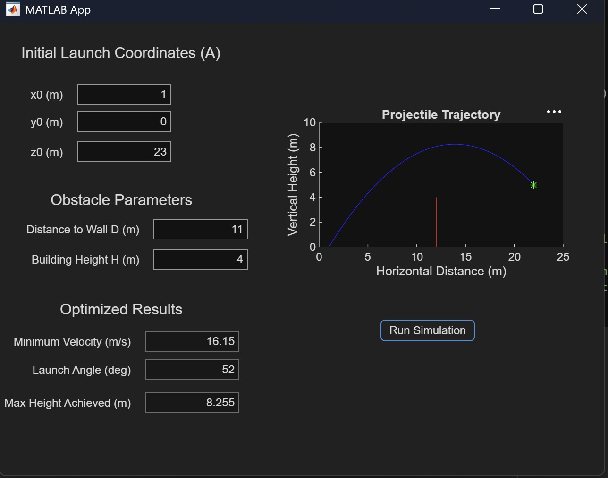
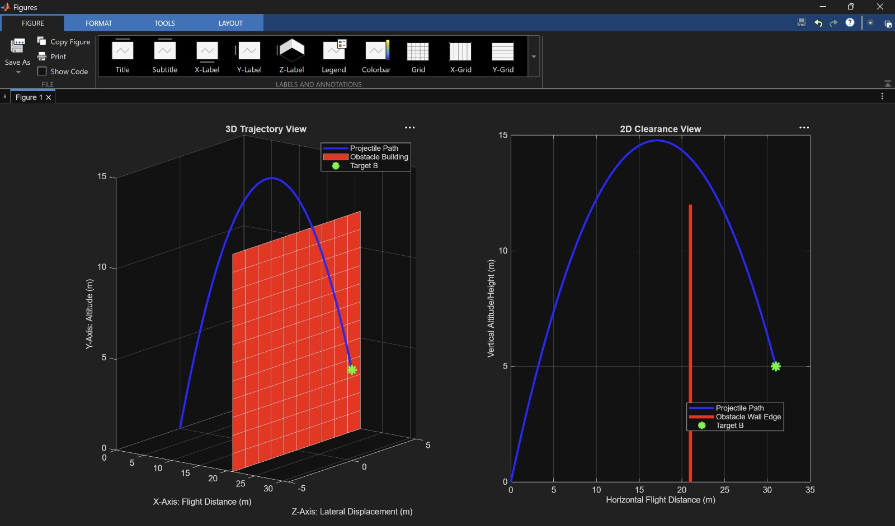

# Autonomous Projectile Trajectory Optimizer & Interactive App

An engineering simulation tool developed in MATLAB that calculates the absolute minimum required launch velocity and optimal angle for a projectile to successfully clear a tall obstacle and strike a designated destination target.

## Features
* **Kinematic Optimization Engine:** Iteratively scans launch angles to find the most energy-efficient (lowest velocity) trajectory.
* **Safety Buffer Constraints:** Accounts for a user-defined physical clearance margin over obstacles.
* **Remarkable Exception Handling:** Detects impossible configurations and reports non-physical boundaries using NaN limits, preventing program runtime crashes.
* **Interactive Graphical User Interface (GUI):** Built using MATLAB App Designer with integrated dynamic plotting and read-only numerical displays.

## Visual Interface
**App Interface Demo**

**2D and 3D Simulation Plots**

## How It Works
The solver uses the projectile dynamics equations to calculate required velocities across a bounded search array (`linspace(1, 89, 2000)`). By checking the altitude directly above the obstacle wall coordinate: y_build = y0 + V_req * sin(alpha_rad) * t_build - 0.5 * g * (t_build^2).
The system filters out invalid paths, isolates the lowest velocity option, and maps the resulting coordinates directly onto the GUI.

## Files Included
* `projectile_trajectory.m`: Main code that displays side-by-side 2D and 3D subplots when run.
* `projectile_trajectory_app1.mlapp`: Graphical-User Interactive Application.
